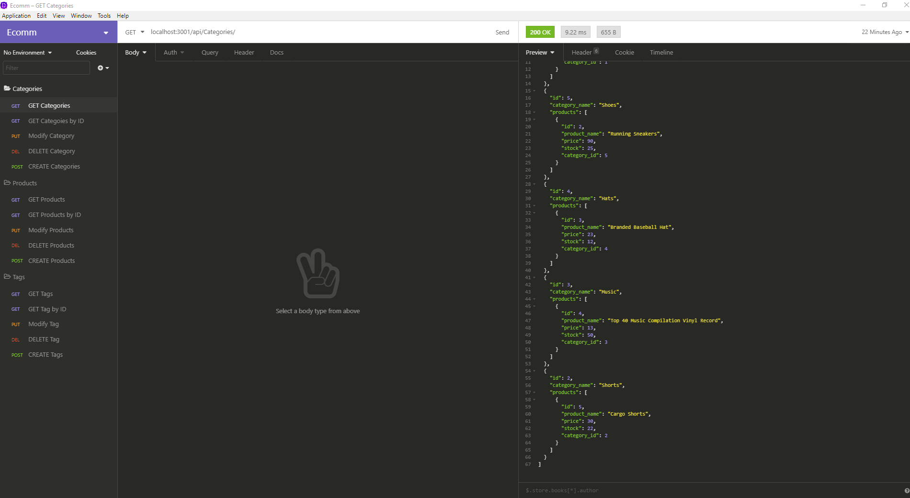

# Employee-Tracker

This Node application is for a business owner to be able to view and manage departments, roles, and employees in their company in order to organize and plan their business.

The application gives yout the following options:
* View all employees with the option by role, department, or manager
* Add an employee, role, or department
* Update an employee role or manager
* Delete employee, role, or department
* View department salary budgets

## Installation
---
1. Run `npm install` to install all dependencies
2. Run `schema.sql` in MySQLWorkbench
    * (BONUS) Run `seeds.sql` in MySQLWorkbench
3. Edit MySQL connection properties in the `db/connection.js` object in `employee-tracker.js`

## Usage
---
1. Run `node index` in cmd or chosen Terminal to start the application
2. Select from the menu to view, add, remove, or update employees, roles, departments, or managers

    

3. Follow prompt if presented

    

## Tool & Resources
---
* [Node.js](https://nodejs.org/en/) - JavaScript runtime environment
* [MySQLWorkbench](https://www.mysql.com/products/workbench/) - Visual database design tool
    ### Dependencies
    ---
    * [inquirer](https://www.npmjs.com/package/inquirer) - For the CLI user interface. This will prompt user within the CLI for employee information.
    * [console.table](https://www.npmjs.com/package/console.table) - Used to print MySQL into tables to the console.
    * [mysql2](https://www.npmjs.com/package/mysql2) - Used to connect to the MySQL database and perform queries

* [RepoLink] https://github.com/Ceven8498/EmployeeTracker

## Video Tutorial

* [VideoLink]https://youtu.be/ro6L4QzT3hI